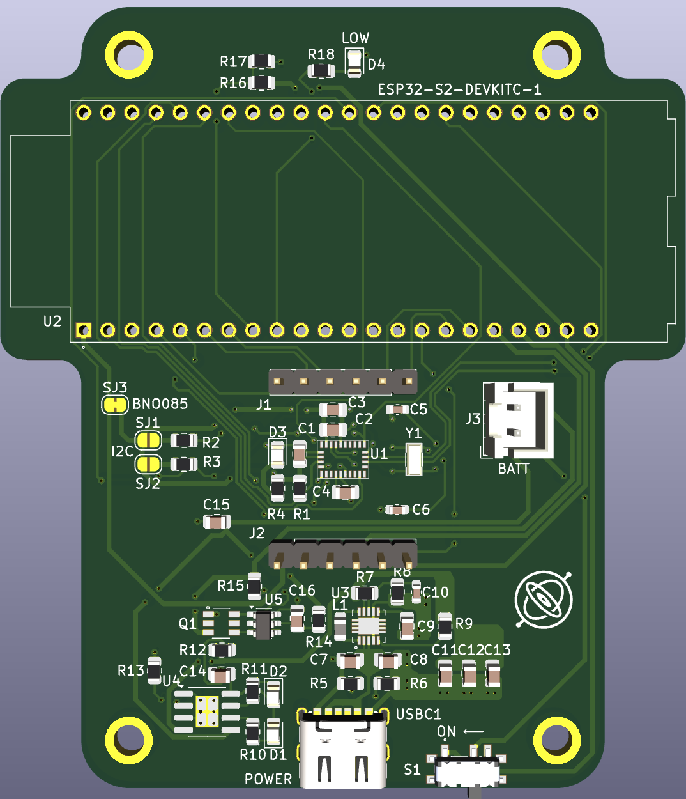
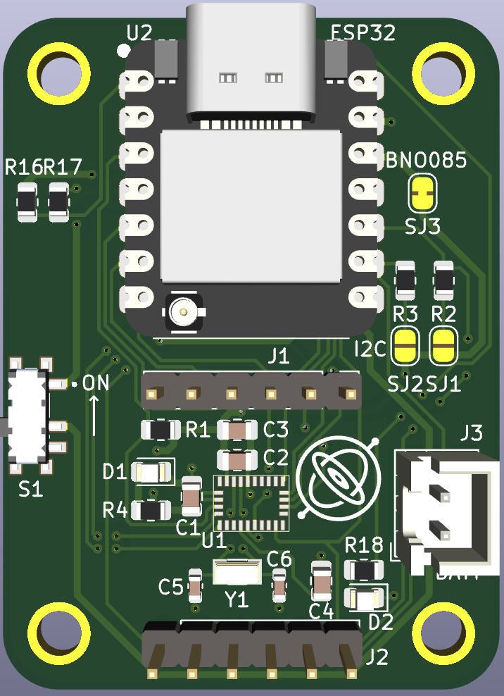

# 3-IMU Leg Visualisation and Orientation Estimation using EKF

## Overview
This project implements a multi-sensor orientation tracking system using three IMUs and an **Extended Kalman Filter (EKF)**. It estimates roll, pitch, and yaw for a simulated leg mechanism. The system fuses gyroscope, accelerometer, and magnetometer data to improve accuracy and reduce drift in real-time orientation estimation.

---

## Visual Output

Below is a frame from the live **3D IMU visualisation** representing a leg mechanism composed of three stacked IMUs (shin, thigh, hip):


---

## Sensor Limitations (From Report)

### Accelerometer Limitations:


### Gyroscope Drift:


### Magnetometer Distortion:


Each inertial sensor alone is insufficient due to:
- **Accelerometers** being sensitive to movement-induced noise.
- **Gyroscopes** suffering from long-term drift.
- **Magnetometers** being distorted by nearby objects.

---

## Sensor Fusion: Extended Kalman Filter (EKF)

An EKF is used to fuse all three sensors. It improves:
- **Stability** of roll and pitch using accelerometer feedback.
- **Responsiveness** and short-term accuracy via gyroscope integration.
- **Yaw correction** using magnetometer headings.

The EKF runs on a **XIAO ESP32-S3** and is implemented in **C**, processing SPI-fed data from a **BNO08x IMU** at up to 100 Hz.

```c
void ekf_update(struct raw_angle_data *rad, float g[3], float x[3], float x_prev[3], float P[3][3], const float A[3][3], const float Q[3][3], const float R[3][3], const float I[3][3]) {
  // State
  for (int i = 0; i < 3; i++) {
      x[i] = wrap_angle(x_prev[i] + g[i]);
  }

  // State covariance: P = A*P*A^T + Q (A = identity matrix)
  for (int i = 0; i < 3; i++) {
    for (int j = 0; j < 3; j++) {
      P[i][j] += Q[i][j];
    }
  }

  float z[3] = {rad->accel_roll, rad->accel_pitch, rad->mag_yaw};

  // Measurement residual: y = z - Hx
  float y[3];
  for (int i = 0; i < 3; i++) {
    y[i] = wrap_angle(z[i] - x[i]);
  }

  // Innovation covariance: S = H*P*H^T + R
  float S[3][3];
  for (int i = 0; i < 3; i++) {
    for (int j = 0; j < 3; j++) {
      S[i][j] = P[i][j] + R[i][j];
    }
  }

  // Kalman gain: K = P*H^T*S^-1
  float S_inv[3][3];
  invert3x3(S, S_inv);

  float K[3][3];
  multiply3x3(P, S_inv, K);

  // Update state: x = x + K*y
  for (int i = 0; i < 3; i++) {
    for (int j = 0; j < 3; j++) {
      x[i] += K[i][j] * y[j];
    }
    x[i] = wrap_angle(x[i]);
  }

  // Update state covariance: P = (I - KH)*P
  float I_minus_k[3][3];
  for (int i = 0; i < 3; i++) {
    for (int j = 0; j < 3; j++) {
        I_minus_k[i][j] = I[i][j] - K[i][j];
      }
  }

  float temp[3][3];
  multiply3x3(I_minus_k, P, temp);
  copy3x3(temp, P);

  for (int i = 0; i < 3; i++) {
    x_prev[i] = x[i];
  }
}
```

---

## Performance Evaluation

Orientation tracking was evaluated using a custom **laser-engraved MDF gimbal** rotated in 5° steps. Error histograms and uncertainty analysis were produced:

- **Roll Accuracy**: ±2.2°
- **Pitch Accuracy**: ±2.4°
- **Yaw Error**: High variance due to magnetometer

### Roll Error Distribution:


### Pitch Error Distribution:


### Yaw Error Distribution:


---


---

## Custom PCB Designs

### Device 1: EKF + IMU Integration Board


### Device 2: ESP32-Based IMU Module


## Repository Structure
```
engee523_limb_tracker-main/
├── ekf.c
├── ekf.h
├── imu_read.c
├── main.c
├── visualiser.py
├── README.md
```

---

## Hardware Used
- **MCU**: XIAO ESP32-S3
- **IMU**: BNO08x (SPI interface)
- **Display**: Python 3D visualiser with `matplotlib`
- **Host Tools**: Real-time serial data parser and visualisation

---

## References
- Extended Kalman Filter concepts
- Bosch BNO08x datasheets
- ENGEE523 Technical Report (2025)
