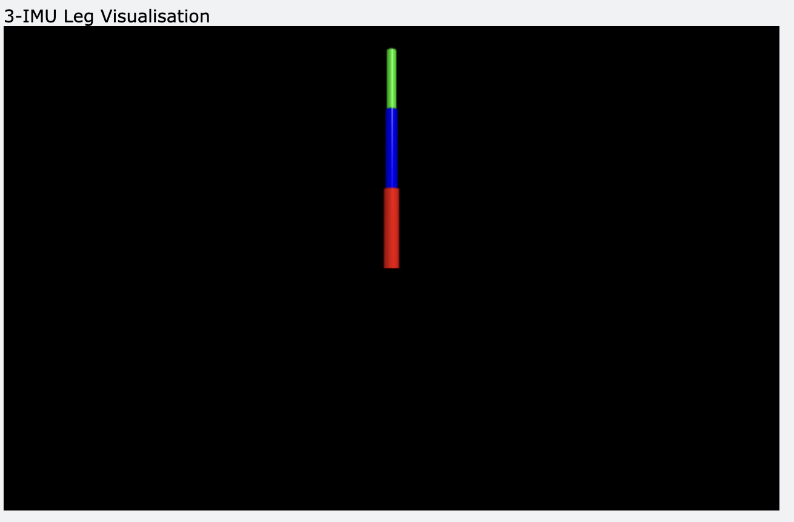
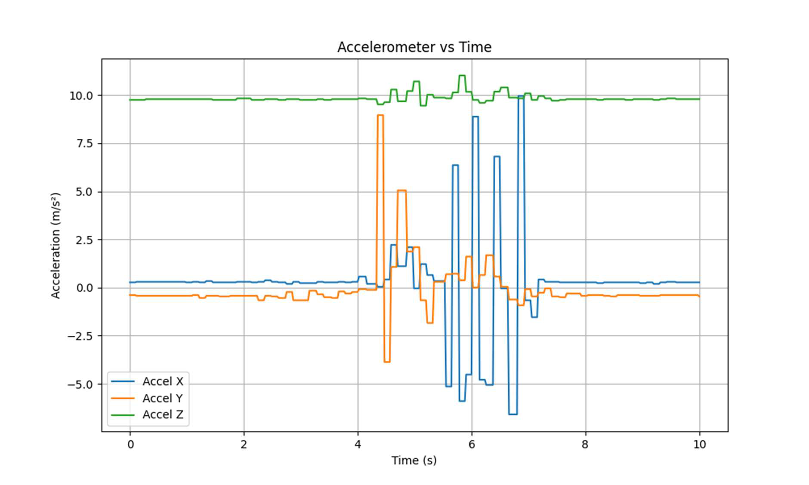
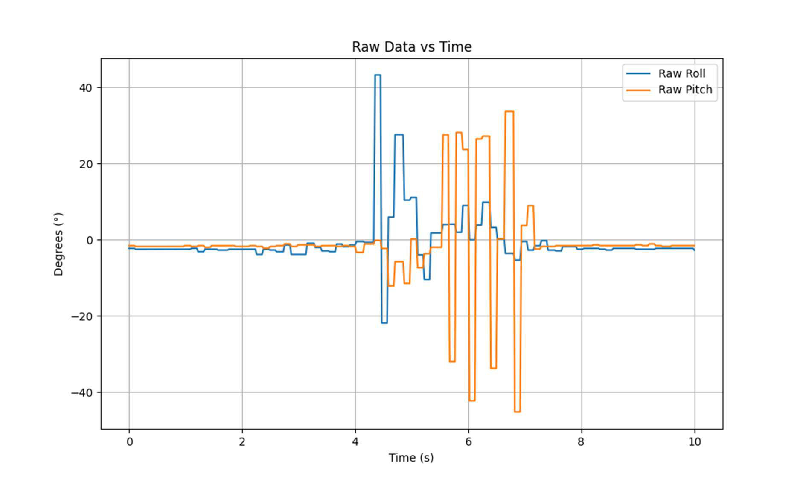
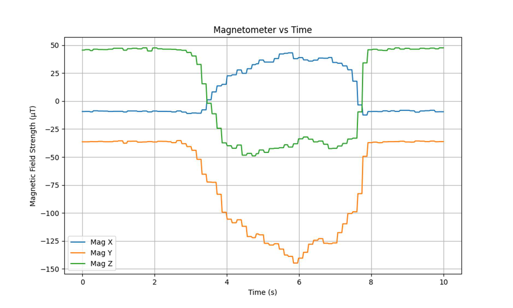
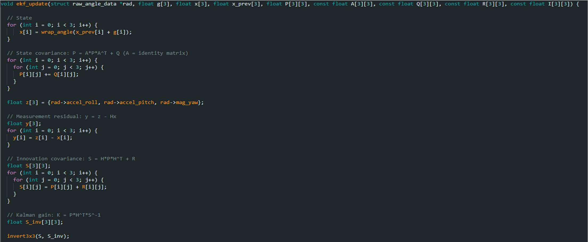
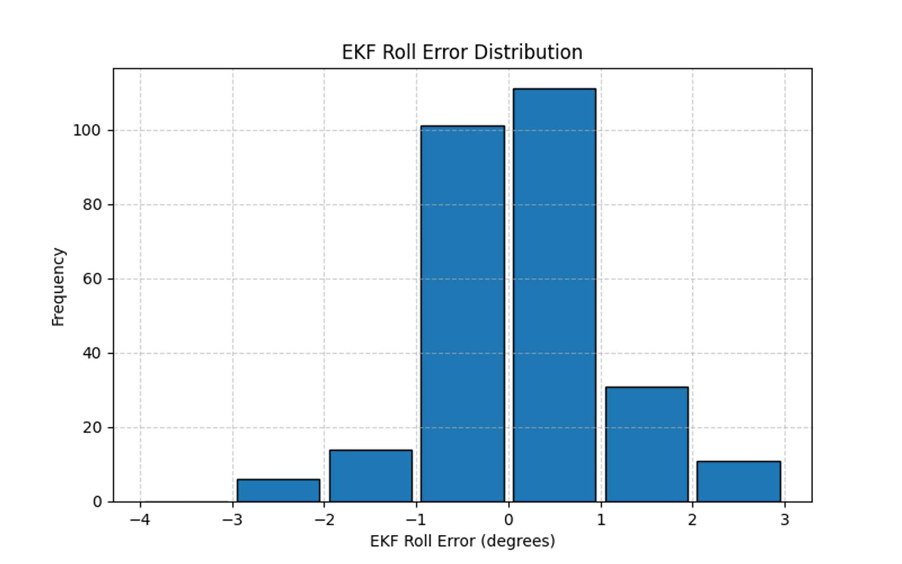
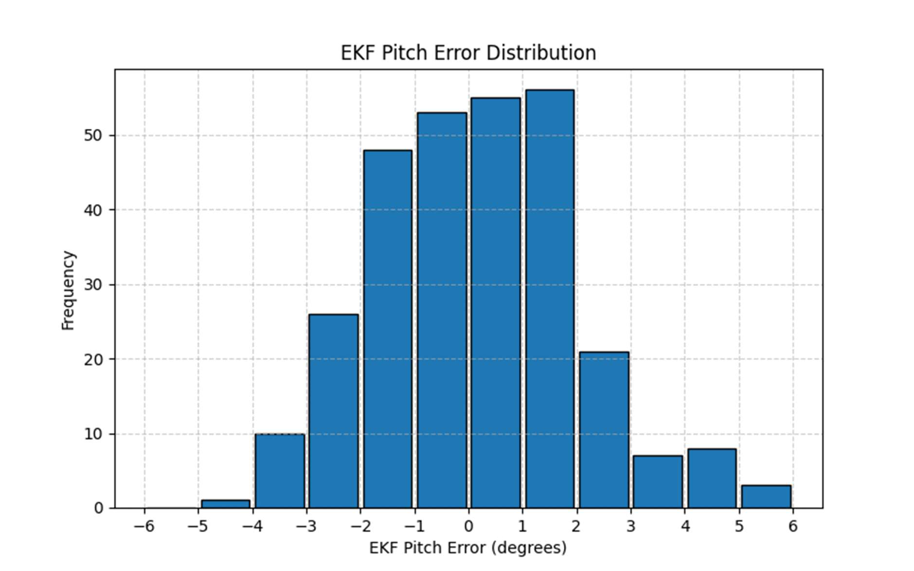
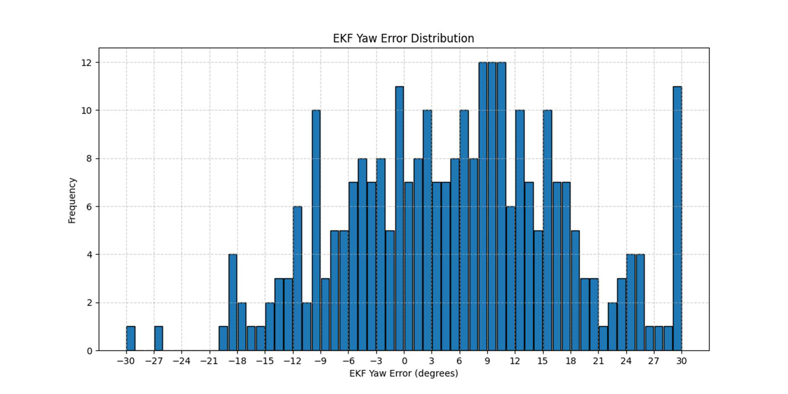

# Leg Visualisation and Orientation Estimation using EKF

## Overview
This project implements a multi-sensor orientation tracking system using three IMUs and an **Extended Kalman Filter (EKF)**. It estimates roll, pitch, and yaw for a simulated leg mechanism. The system fuses gyroscope, accelerometer, and magnetometer data to improve accuracy and reduce drift in real-time orientation estimation.

---

## Visual Output

Below is a frame from the live **3D IMU visualisation** representing a leg mechanism composed of three stacked IMUs (shin, thigh, hip):



---

## Sensor Limitations (From Report)

### Accelerometer Limitations:


### Gyroscope Drift:


### Magnetometer Distortion:


Each inertial sensor alone is insufficient due to:
- **Accelerometers** being sensitive to movement-induced noise.
- **Gyroscopes** suffering from long-term drift.
- **Magnetometers** being distorted by nearby objects.

---

## Sensor Fusion: Extended Kalman Filter (EKF)

An EKF is used to fuse all three sensors. It improves:
- **Stability** of roll and pitch using accelerometer feedback.
- **Responsiveness** and short-term accuracy via gyroscope integration.
- **Yaw correction** using magnetometer headings.

The EKF runs on a **XIAO ESP32-S3** and is implemented in **C**, processing SPI-fed data from a **BNO08x IMU** at up to 100 Hz.



---

## Performance Evaluation

Orientation tracking was evaluated using a custom **laser-engraved MDF gimbal** rotated in 5° steps. Error histograms and uncertainty analysis were produced:

- **Roll Accuracy**: ±2.2°
- **Pitch Accuracy**: ±2.4°
- **Yaw Error**: High variance due to magnetometer

### Roll Error Distribution:


### Pitch Error Distribution:


### Yaw Error Distribution:


---

## Repository Structure
```
engee523_limb_tracker-main/
├── ekf.c
├── ekf.h
├── imu_read.c
├── main.c
├── visualiser.py
├── README.md
```

---

## Hardware Used
- **MCU**: XIAO ESP32-S3
- **IMU**: BNO08x (SPI interface)
- **Display**: Python 3D visualiser with `matplotlib`
- **Host Tools**: Real-time serial data parser and visualisation

---

## References
- Extended Kalman Filter concepts
- Bosch BNO08x datasheets
- ENGEE523 Technical Report (2025)
